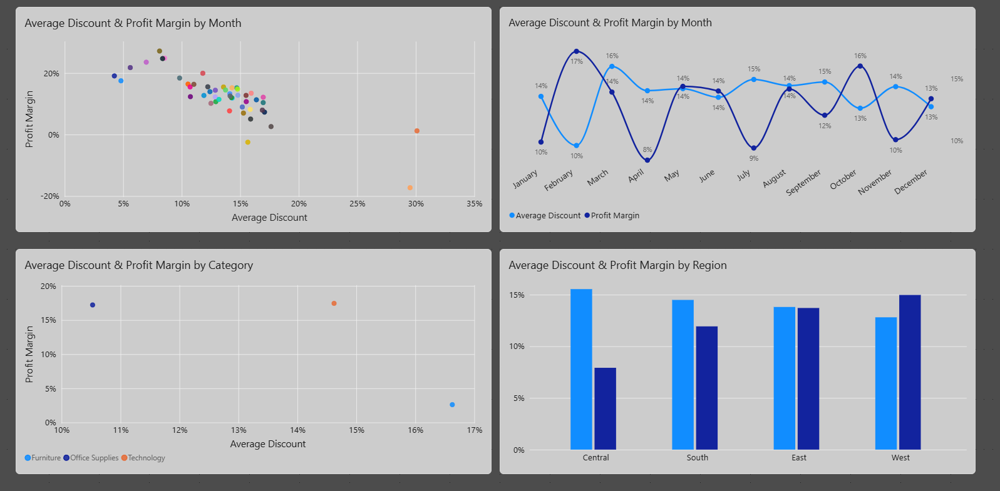

# Sales & Profitability Analysis


This project looks at sales and profitability throughout the year, focusing on monthly performance, regions, product categories, and discounts.


The main goal was to understand where the business performs well, where margins are weaker, and whether higher discounts are associated with lower profitability.


## Tools


- **Python** — data quality and preparation

- **PostgreSQL** — data analysis

- **Power BI Desktop** — dashboard and visualization


## What I did


I started by checking and preparing the data in Python. This included looking at missing values, duplicates, data types, and date fields that needed to be converted from strings to datetime.


I then used PostgreSQL to explore sales, profit, margins, regions, categories, and discounts.


The analysis was then put together in a Power BI dashboard.


## Dashboard




The dashboard covers:


- Monthly performance

- Regional performance

- Category performance

- Discounts and profitability


## Key Findings


- **West** had the strongest regional performance, with a 15% profit margin.

- **Furniture** had the lowest category margin at 3%.

- **Central** had the lowest regional margin at 8%.

- **Higher discounts** were associated with lower margins in some weaker-performing segments.


## Report

The full analysis, findings, and recommendations are available in the [final report](docs/Report.pdf).


## Dataset


The project uses the [Superstore Sales Dataset](https://www.kaggle.com/datasets/himanshuuike/superstore-sales-dataset) from Kaggle.


The dataset is published under the **CC0: Public Domain** license.


## Project Structure


```text

sales-profitability-analysis/

├── data/

│   ├── raw/

│   └── processed/

├── notebooks/

├── sql/

├── powerbi/

├── docs/

├── images/

├── README.md

└── requirements.txt

```
